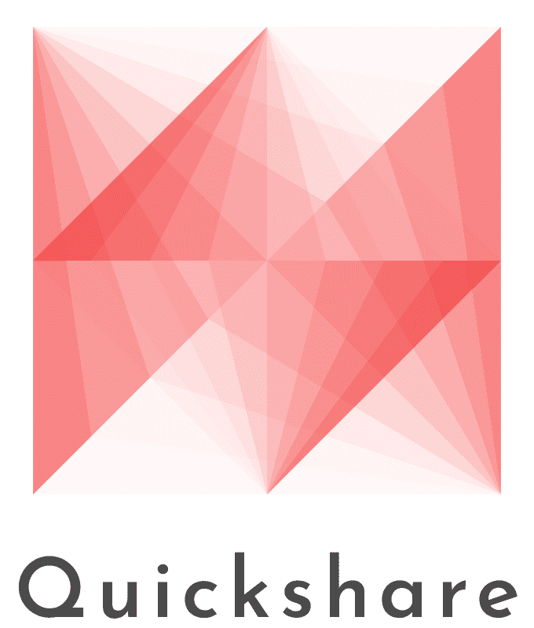

# Quickshare
> Creating a network which brings all your necessities together

<!-- [![Contributors][contributors-shield]][contributors-url]
[![Stargazers][stars-shield]][stars-url]
[![Issues][issues-shield]][issues-url]
[![MIT License][license-shield]][license-url] -->

 
 

<!-- ABOUT THE PROJECT -->
# About The Project

<!-- Add screen shot of gui -->
[![Product Name Screen Shot][product-screenshot]](https://example.com)

Quickshare is a tool that intends to simplify and speed up the process of sharing files, especially on local networks. We all have been stuck with the issue of quickly sharing files/folder onto other devices in the house, and therefore quickshare aims at tackling that issue.
 
 

# Built With

 
 

<!-- GETTING STARTED -->
# Getting Started

To get started head over to the [releases](https://github.com/MadMax129/Quickshare/releases/) page and select the latest release for your platform. This will provide the application executable and will contain all you need to get started with Quickshare.

<!-- USAGE EXAMPLES -->
## Usage

A simple example of ussage maybe add a gif....

_For more examples, please refer to the [Documentation](https://example.com)_
 
 

<!-- ROADMAP -->
# Roadmap
- [ ] Add Additional Templates w/ Examples
- [ ] Add "components" document to easily copy & paste sections of the readme
- [ ] Multi-language Support
    - [ ] Chinese
    - [ ] Spanish

See the [open issues](https://github.com/othneildrew/Best-README-Template/issues) for a full list of proposed features (and known issues).

<!-- CONTRIBUTING -->
## Contributing

Contributions are what make the open source community such an amazing place to learn, inspire, and create. Any contributions you make are **greatly appreciated**.

If you have a suggestion that would make this better, please fork the repo and create a pull request. You can also simply open an issue with the tag "enhancement".
Don't forget to give the project a star! Thanks again!

1. Fork the Project
2. Create your Feature Branch (`git checkout -b feature/AmazingFeature`)
3. Commit your Changes (`git commit -m 'Add some AmazingFeature'`)
4. Push to the Branch (`git push origin feature/AmazingFeature`)
5. Open a Pull Request

<!-- LICENSE -->
## License

Distributed under the Apache 2.0 License. See `LICENSE` for more information.

<!-- CONTACT -->
## Contact

Your Name - [@your_twitter](https://twitter.com/your_username) - email@example.com

Project Link: [https://github.com/your_username/repo_name](https://github.com/your_username/repo_name)

<!-- ACKNOWLEDGMENTS -->
## Acknowledgments

Use this space to list resources you find helpful and would like to give credit to. I've included a few of my favorites to kick things off!

* [Choose an Open Source License](https://choosealicense.com)
* [GitHub Emoji Cheat Sheet](https://www.webpagefx.com/tools/emoji-cheat-sheet)
* [Malven's Flexbox Cheatsheet](https://flexbox.malven.co/)
* [Malven's Grid Cheatsheet](https://grid.malven.co/)
* [Img Shields](https://shields.io)
* [GitHub Pages](https://pages.github.com)
* [Font Awesome](https://fontawesome.com)
* [React Icons](https://react-icons.github.io/react-icons/search)

<!-- MARKDOWN LINKS & IMAGES -->
<!-- https://www.markdownguide.org/basic-syntax/#reference-style-links -->
[contributors-shield]: https://img.shields.io/github/contributors/MadMax129/Quickshare.svg?style=for-the-badge
[stars-shield]: https://img.shields.io/github/stars/MadMax129/Quickshare.svg?style=for-the-badge
[issues-shield]: https://img.shields.io/github/issues/MadMax129/Quickshare.svg?style=for-the-badge
[license-shield]: https://img.shields.io/github/license/MadMax129/Quickshare.svg?style=for-the-badge

[contributors-url]: https://github.com/MadMax129/Quickshare/graphs/contributors
[stars-url]: https://github.com/MadMax129/Quickshare/stargazers
[issues-url]: https://github.com/MadMax129/Quickshare/issues
[license-url]: https://github.com/MadMax129/Quickshare/blob/master/LICENSE

[product-screenshot]: images/screenshot.png
[C++]: https://upload.wikimedia.org/wikipedia/commons/1/18/ISO_C%2B%2B_Logo.svg
[ImGUI]: https://cloud.githubusercontent.com/assets/8225057/9825766/8b0de6c8-58cd-11e5-960f-0eeed4004d6c.png
[imgui-url]: https://github.com/ocornut/imgui
